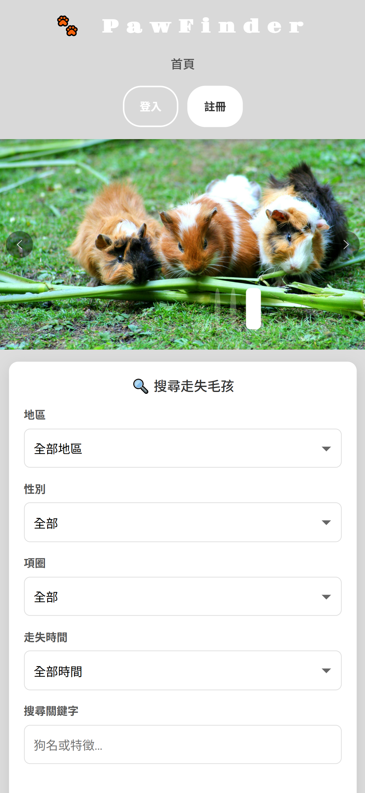
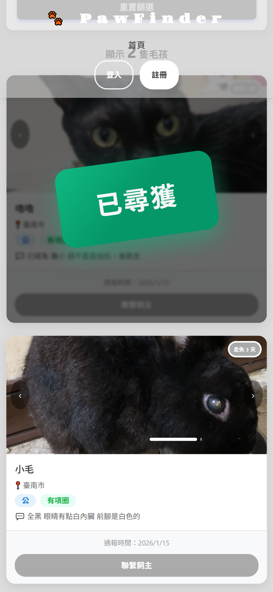
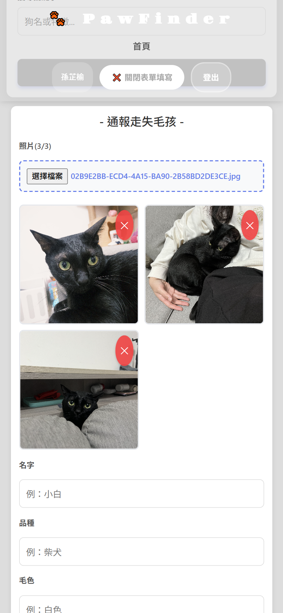
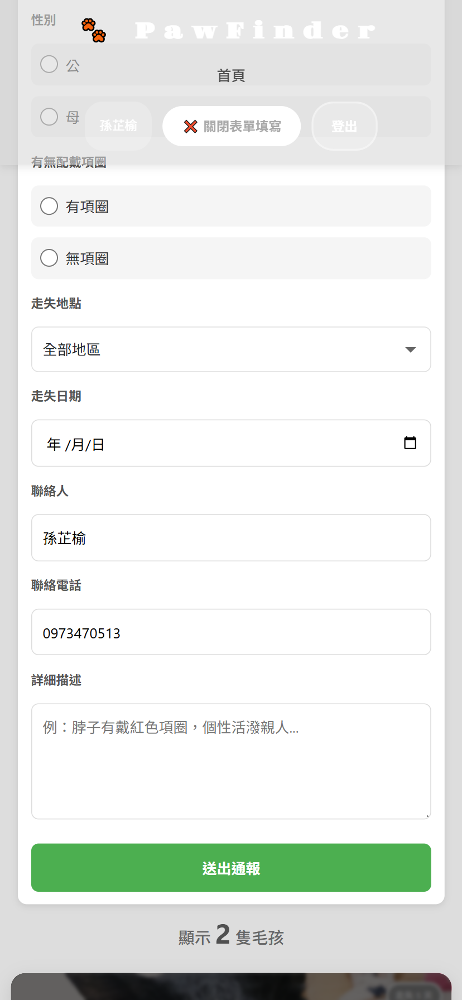
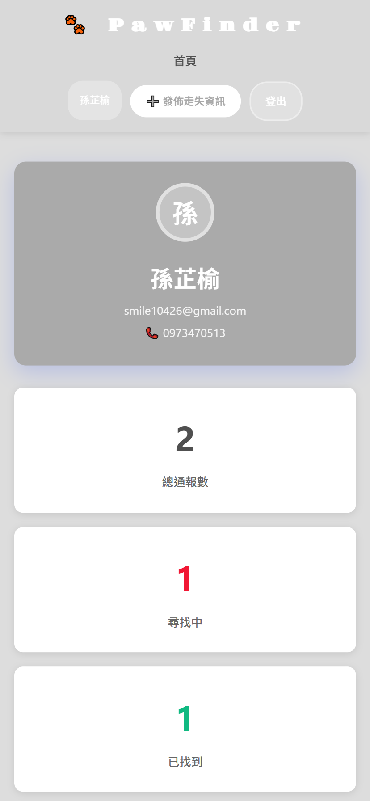
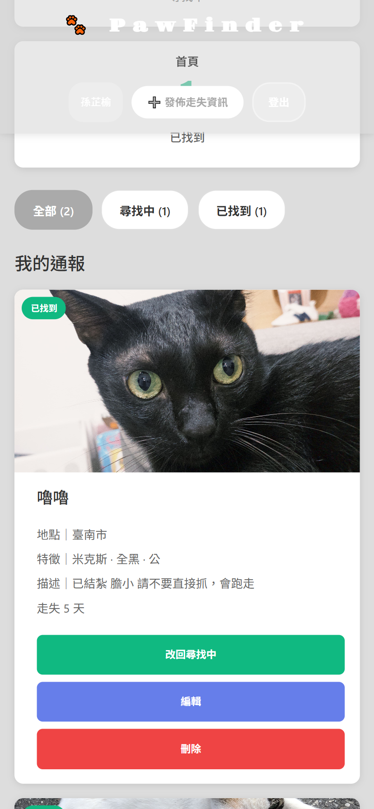

# 🐕 PawFinder - 走失毛孩協尋平台
> 一個基於 React 與 Firebase 的流浪動物即時通報平台。

[](https://pawfinder-zeta.vercel.app/)
[](https://reactjs.org/)
[](https://firebase.google.com/)

> [!TIP]
> **快速體驗**
> 使用測試帳號登入，查看管理後台與已發布的案例：
> - **帳號**：**`test@example.com`**
> - **密碼**：**`test123456`**
> 
> *( 註：您也可以自行註冊帳號體驗完整的通報發布流程 )*

## 📖 目錄
- [開發動機](#開發動機)
- [技術架構](#技術架構)
- [核心功能](#核心功能)
- [技術挑戰與解決方案](#技術挑戰與解決方案)
- [開發環境設定](#開發環境設定)
- [專案截圖](#專案截圖)

## 開發動機
目前寵物協尋多依賴社群平台（如 Facebook 社團），但常面臨以下痛點：

**現有問題分析**
* 資訊難以篩選：無法精確過濾地區或時間，熱心民眾難以尋找家附近的案例。
* 狀態更新不即時：已找回的資訊仍持續干擾搜尋結果，造成資訊混亂。
* 格式不統一：缺乏結構化欄位，導致關鍵特徵（如品種、項圈）容易漏掉。

**解決方案**
我透過 React + Firebase 建立此平台，將散亂的資訊轉化為可篩選、可追蹤的有效數據。

## 專案截圖

### 1. 首頁與混合式即時篩選系統


<p><i>透過前端即時過濾技術，實現點選條件後立即呈現搜尋結果，無需等待頁面重整。</i></p>

### 2. 通報發布流程


<p><i>表單支援多圖上傳預覽，並透過Promise.all進行非同步上傳，在確保所有圖片成功存儲後才寫入資料庫，保障資料完整性。</i></p>

### 3. 個人管理中心


<p><i>使用Firebase Auth實作權限驗證，僅原發布者可進行編輯或刪除；<br/>支援「尋找中 / 已找到」狀態的一鍵即時同步。</i></p>

### 4. 響應式設計 (RWD)
#### **A. 瀏覽與搜尋 (首頁 & 列表)**
| 首頁視覺 | 卡片列表 |
| :---: | :---: |
|  |  |
| *直向延伸的視覺佈局* | *適合單手滑動的卡片設計* |

#### **B. 快速通報流程 (填寫表單)**
| 表單上半部 (圖片預覽) | 表單下半部 (送出表單) |
| :---: | :---: |
|  |  |
| *結構化欄位引導* | *支援手機相簿多圖選取* |

#### **C. 會員管理中心 (個人中心)**
| 帳戶資訊 | 案件狀態管理 |
| :---: | :---: |
|  |  |
| *直覺的會員選單* | *一鍵切換尋獲狀態* |
## 技術架構

### 前端開發
- **React 18 (Hooks)**：全面採用 Functional Components，利用 useEffect 處理 Firebase 監聽，並透過 useContext 實作狀態共享。
- **Context API**：針對使用者認證（Auth）實作全域狀態管理。決策理由： 考量專案規模與維護成本，選擇輕量化的 Context API 替代 Redux，避免過度開發（Over-engineering）。
- **Responsive Design**：使用 CSS3 Flexbox/Grid 結合 Bootstrap，確保飼主在戶外使用手機時能有流暢的通報體驗。

### 後端服務(Firebase Serverless)
- **Cloud Firestore**：選擇 NoSQL 架構以因應欄位彈性需求。
  - **擴展性說明**：目前代碼中保留部分 `dog` 命名（如 `DogCard`），是因為初期以狗狗協尋為開發場景。
  - **通用設計**：底層資料結構與前端 Props 邏輯均採抽象化架構，僅需新增 `petType` 標籤就可以擴展至貓、兔等各類寵物。
- **Firebase Storage**：存放高解析度走失照片，並實作非同步上傳流程。
- **Security Rules**：透過後端規則定義資料存取權限，確保僅發布者本人具備修改權限。
```
allow update, delete: if request.auth.uid == resource.data.userId;
```

### 開發規範與工具
- **版本控制 (Git)**：遵循 Conventional Commits 規範進行提交，確保版本紀錄清晰、具備可讀性。
- **自動化部署 (CI/CD)**：整合 Vercel 實作自動化部署，確保代碼推送至 main 分支後即時更新線上版本。
- **套件管理**：使用 npm 進行相依性管理。

## 核心功能
* 權限管理：使用 Firebase Auth 搭配 Firestore Security Rules，將存取控制責任移至後端，避免僅依賴前端邏輯。
* 友善錯誤反饋系統：實作 errorHelper 機制，將後端回傳的技術性錯誤訊息（Firebase Error Codes）轉譯為人性化的中文通知。
* 智慧天數計算：自動根據走失日期動態顯示「走失天數」，幫助判斷案件緊急程度。
* 即時狀態切換：提供「尋找中」與「已找到」篩選，確保平台資訊即時有效。

## 技術挑戰與解決方案

> 這是專案開發過程中最核心的技術點

### 1. 混合式資料篩選架構

**挑戰：**
在實作複合條件篩選（地區、性別、時間、關鍵字）時，若每次更換條件都向資料庫發送請求，會造成明顯的畫面閃爍與讀取延遲，增加 Firebase 的讀取成本。

**解決方案：**
採取**兩段式處理邏輯**，改善讀取體驗與效能：

- **後端階段**：初始載入時透過 Firestore 進行結構化查詢並預排序（OrderBy `createdAt`），確保基礎資料庫操作的精確性。
- **前端階段**：利用 React State 搭配原生 JavaScript `.filter()` 處理複雜條件。特別是在「走失天數」計算上，直接於前端進行動態時間差運算，省去了伺服器端的負擔。

### 2. 非同步多圖上傳與資料一致性

**挑戰：** 確保多張寵物照片完整上傳，並與文字資訊同步寫入資料庫。

**解決方案：**
```javascript
// 使用 Promise.all 確保所有圖片上傳完成後才寫入資料庫
const uploadAllImages = async (files) => {
  const uploadPromises = files.map(file => uploadImage(file));
  return await Promise.all(uploadPromises);
};

// 在表單提交時先等待圖片上傳
const imageUrls = await uploadAllImages(imageFiles);
await addDoc(collection(db, 'lostDogs'), { ...formData, imageUrls });
```

### 3. 基於後端的安全性控管

**挑戰：** 防止惡意竄改他人發布的資訊。

**解決方案：**

```firestore
// Firebase Security Rules - 多層次權限控管

// 通報資料：登入可讀，僅原作者可修改
match /lostDogs/{dogId} {
  allow read, create: if request.auth != null;
  allow update, delete: if request.auth != null 
    && request.auth.uid == resource.data.userId;
}

// 使用者敏感資料：僅限帳號本人擁有完整讀寫權限
match /users/{userId} {
  allow read, write: if request.auth.uid == userId;
}
```

## 開發環境設定
如果你想在本地端運行此專案，請參考以下步驟：

### 環境需求
- Node.js 14.0 以上
- npm 或 yarn

### 安裝步驟

1. **clone 專案**
```bash
git clone https://github.com/olivia23sun/pawfinder.git
cd pawfinder
npm install
```

2. **設定環境變數**
> 本專案使用 Firebase 服務，請在根目錄建立 `.env` 檔案，並參考 `.env.example` 填入您的金鑰：

```env
REACT_APP_FIREBASE_API_KEY=你的_API_金鑰
REACT_APP_FIREBASE_AUTH_DOMAIN=你的專案.firebaseapp.com
REACT_APP_FIREBASE_PROJECT_ID=你的專案ID
REACT_APP_FIREBASE_STORAGE_BUCKET=你的專案.firebasestorage.app
REACT_APP_FIREBASE_MESSAGING_SENDER_ID=你的發送者ID
REACT_APP_FIREBASE_APP_ID=你的應用ID
```

3. **啟動開發伺服器**
```bash
npm start
```

## 未來規劃
**效能優化 (Scalability)**：若日後資料量增長，預計引入**分頁載入 (Pagination)** 或**進階混合式篩選**（將「地區」移至後端 Firestore `where` 查詢，其餘細節保留在前端過濾），以維持最佳載入速度。
**地圖視覺化 (GIS 整合)：**串接 Google Maps API，將文字地址轉化為地圖標籤，讓協尋者能更直觀地掌握周遭的走失案例。
**即時通報系統：**整合瀏覽器推播通知 (Push API)，當特定區域有新通報時，第一時間通知附近的熱心民眾。
**影像辨識輔助：**規劃引入 AI 影像比對技術，自動過濾並提示特徵相似度較高的通報，降低人工篩選的時間成本。

## 聯絡方式

- **專案作者**：孫芷榆
- **Email**：smile10426@gmail.com
- **GitHub**：https://github.com/olivia23sun
